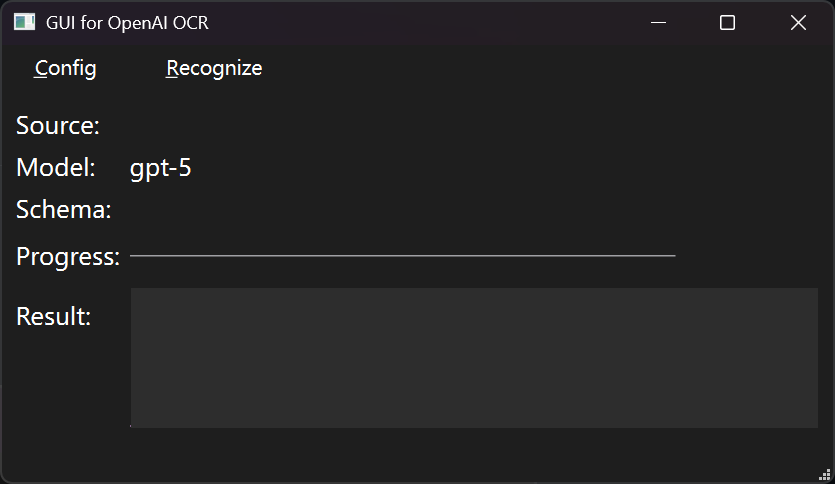
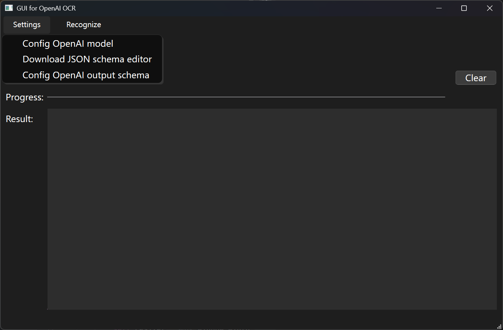
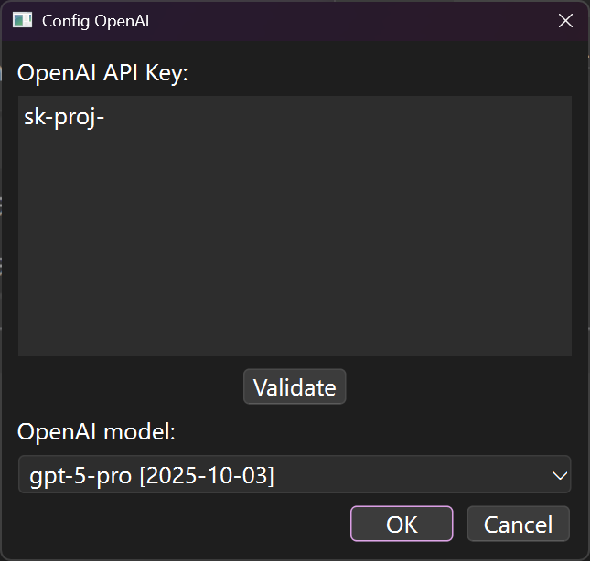
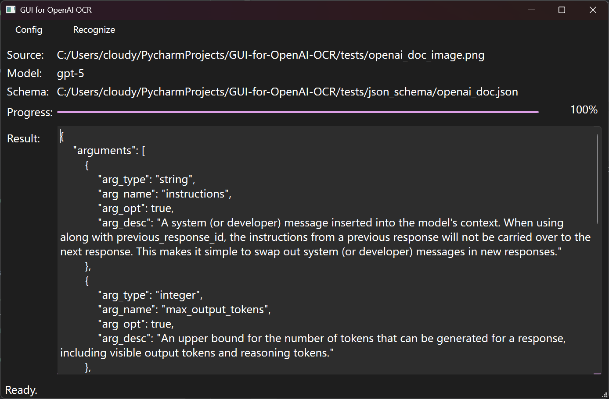

# GUI for OpenAI OCR
The graphic user interface for optical character recognition by OpenAI large language models


## Install

### From source code

Create a Python 3.13 virtual environment and activate.

Run the following commands in Windows command prompt.

```
pip install -r requirements.txt
pyinstaller main.spec
```

### From release

Download the latest release and open `GUI for OpenAI OCR.exe`.


## Usage

To perform OCR, the user has to visit  [OpenAI Platform](https://platform.openai.com/docs/overview) and apply for a prepaid API key, then configure OpenAI model in the program.

### Config OpenAI model

Execute the program and it opens the main window.



Select `Settings -> Config OpenAI model`.



The program will pop up OpenAI configuration window. Fill in OpenAI API Key, then click "Validate". If API key is valid, available models will appear in "OpenAI model" dropdown. Choose a model to perform OCR from these options.



Click "OK" to save the result. OpenAI config will be cached in the program's installation folder. If the user closes the program and opens again, the model is still configured.

### [Optional] Config output schema

After OpenAI model is configured, the user can config the output schema, therefore OCR results will follow a strict structure. 

Use [ours](https://github.com/cloudy-sfu/JSON-schema-editor) or [other](https://json-schema.org/tools?query=&sortBy=name&sortOrder=ascending&groupBy=toolingTypes&licenses=&languages=&drafts=7&toolingTypes=&environments=&showObsolete=false&supportsBowtie=false#editor) JSON schema editor to create one which fits [JSON schema Draft-07](https://json-schema.org/draft-07) standard. 

Select `Settings -> Config OpenAI output schema`, then the program will raise a file explorer window.

Choose the schema (`*.json` file) in file explorer.

### Perform OCR

After both OpenAI model and output schema are configured, in the main window, use actions in `Recognize` menu to perform OCR.

-   From clipboard: the program will read the clipboard and output the result in "Result" area.
-   From single image: the program will pop up file explorer to let the user select the image to recognize; after finished, the program will output the result in "Result" area.
-   From folder: the program will pop up file explorer which asks for the source folder containing images to recognize; then it'll pop up the second file explorer window to ask the destination folder to save OCR result. The result in each image will be saved in a `*.json` or `*.txt` file in the destination folder. Its filename without extension is the same as the corresponding image.


