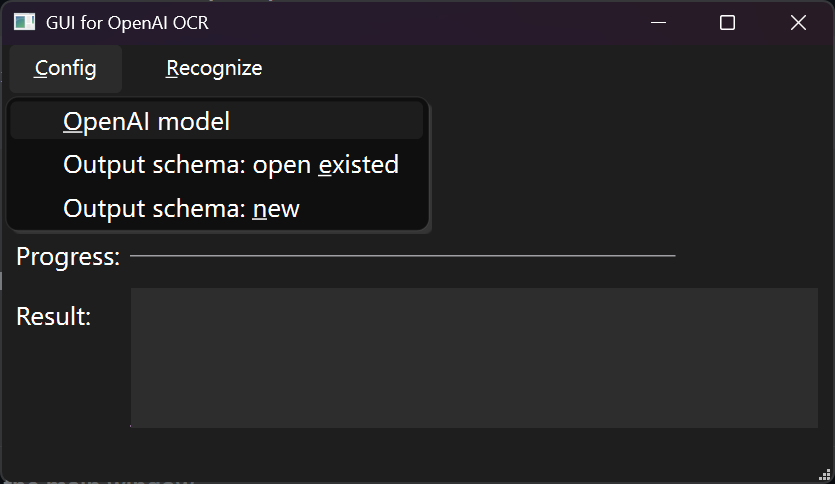
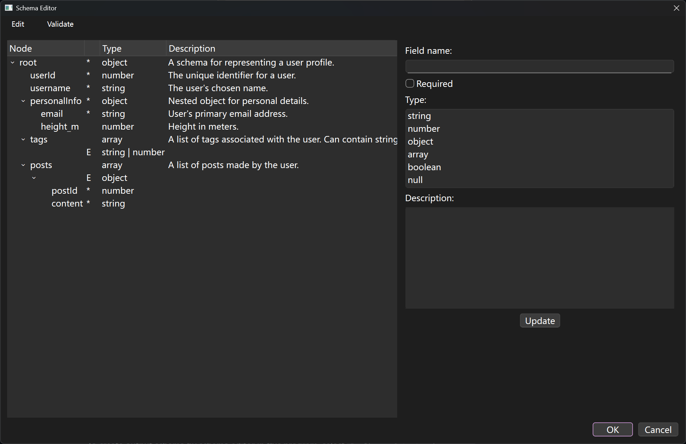

# GUI for OpenAI OCR
The graphic user interface for optical character recognition by OpenAI large language models


## Install

### From source code

Create a Python 3.13 virtual environment and activate.

Run the following commands in Windows command prompt.

```
pip install -r requirements.txt
pyinstaller main.spec
```

### From release

Download the latest release and open `GUI for OpenAI OCR.exe`.


## Usage

To perform OCR, the user has to visit  [OpenAI Platform](https://platform.openai.com/docs/overview) and apply for a prepaid API key, then configure OpenAI model in the program.

### 1. Config OpenAI model

Execute the program and it opens the main window.


Select `Config -> OpenAI model`.



The program will pop up OpenAI configuration window. Fill in OpenAI API Key, then click "Validate". If API key is valid, available models will appear in "OpenAI model" dropdown. Choose a model to perform OCR from these options.


Click "OK" to save the result. OpenAI config will be cached in the program's installation folder. If the user closes the program and opens again, the model is still configured.

### 2. Config output schema

After OpenAI model is configured, config the output schema. The output of OpenAI model (recognition results) will follow the defined output schema.

The output schema can be from two source.

#### 2.1. Get an existed schema from other source

If the schema is from other source, as long as it fits [JSON schema Draft-07](https://json-schema.org/draft-07) standard, it can be used in this program. 

Select `Config -> Output schema: open existed`, then the program will raise a file explorer window.

Choose the schema (`*.json` file) in file explorer.

The program will pop up the schema editor, where the schema can be previewed.



Shortcuts and symbol meanings:

Press `F1` or select `Edit -> Help` in the menu bar to open the help page.

Functions in `Edit` menu:

-   Add child node to currently selected node
-   Delete a node
-   Open the help information

Functions in `Validate` menu:

-   Validate this schema
-   Select a data file and validate whether it fits this schema

To edit a node,, select it and its information will be expanded at the right column. Modify these information and click "Update" to save.

**If clicking (selecting) another node before clicking "Update" to save the current node, the modification will be lost.**

After finished editing, click "OK" to save this schema. The program will overwrite the opened schema (`*.json` file).

#### 2.2. Create one by schema editor in this program

To create output schema by schema editor in this program, select `Config -> Output schema: new`.

The program will pop up a window to ask user where to save the new schema file.

After giving the output path, the schema editor will initialize a new schema. The user can edit this opened schema file.

After finished editing, click "OK" to save this schema. The program will write this opened schema to the given file path.

### 3. Perform OCR

After both OpenAI model and output schema are configured, in the main window, use actions in `Recognize` menu to perform OCR.

-   From clipboard: the program will read the clipboard and output the result in "Result" area.
-   From single image: the program will pop up file explorer to let the user select the image to recognize; after finished, the program will output the result in "Result" area.
-   From folder: the program will pop up file explorer which asks for the source folder containing images to recognize; then it'll pop up the second file explorer window to ask the destination folder to save OCR result. The result in each image will be saved in a `*.json` file in the destination folder. Its filename without extension is the same as the corresponding image.


